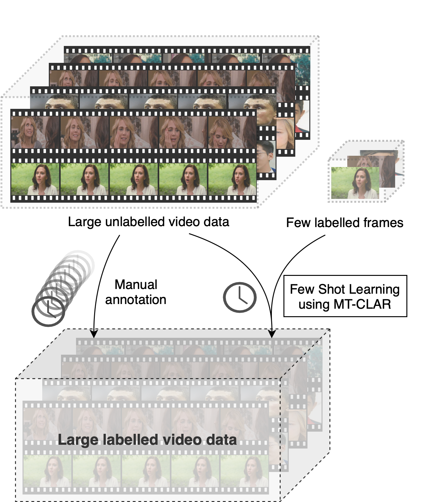
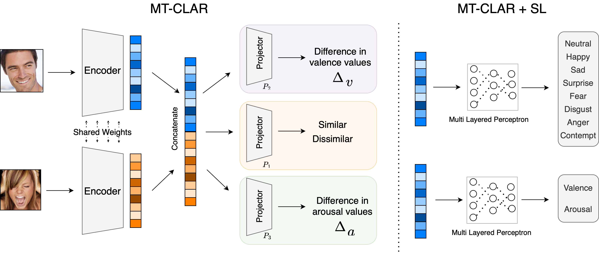

# Efficient Labelling of Affective Video Datasets via Few-Shot \& Multi-Task Contrastive Learning

This is the official PyTorch code repository for the paper **Efficient Labelling of Affective Video Datasets via
Few-Shot \& Multi-Task Contrastive Learning**.

> Accepted at ACM Multimedia 2023

**Link to the paper**: Coming soon

-----

<p align="center">
  
</p>

## Abstract
Whilst deep learning techniques have achieved excellent emotion prediction, they nevertheless require large amounts of
labelled training data, which are (a) onerous and tedious to compile, and (b) prone to errors and biases. We propose
Multi-Task Contrastive Learning for Affect Representation (**MT-CLAR**) for few-shot affect inference. MT-CLAR
combines multi-task learning with a Siamese network trained via contrastive learning to infer from a pair of expressive
facial images (a) the (dis)similarity between the facial expressions, and (b) the difference in valence and arousal
levels of the two faces. We further extend the image-based MT-CLAR framework for automated video labelling wherein,
given one or a few labelled video frames (termed _support-set_), MT-CLAR labels the remainder of the video for
valence and arousal.  Experiments are performed on the AFEW-VA dataset with multiple support-set configurations;
additionally, supervised learning on representations learned via MT-CLAR are utilised for valence, arousal and
categorical emotion prediction on the AffectNet and AFEW-VA datasets. Empirical results confirm that valence and
arousal predictions through MT-CLAR are very comparable to the state-of-the-art (SOTA), and we significantly outperform
SOTA with a support-set $\approx$ 6% the size of the video dataset.

## Requirements
This code was tested on Python 3.8.13, PyTorch 1.13 (dev), and CUDA 11.3. It is recommended to use a virtual environment to
install the dependencies. To install the dependencies, run the following command:

```bash
conda env create -f environment.yml
conda activate mtclar
```

## Datasets
The AFEW-VA dataset can be downloaded from [here](https://ibug.doc.ic.ac.uk/resources/afew-va-database/). The AffectNet
dataset can be downloaded from [here](http://mohammadmahoor.com/affectnet/), after requiring prior approvals from
the authors of the dataset. The AFEW-VA dataset should be placed in the `data/AfewVA` directory, and the AffectNet
dataset should be placed in the `data/AffectNet` directory.


## Pre-trained models
The pre-trained models can be downloaded from [here](https://github.com/face-analysis/emonet).

## Training


To train and evaluate models, configure the `config.yaml` file accordingly to the desired experiment.
For example, the `dataset` field can be set to `afewva`, or `affectnet` to train the MT-CLAR + SL in
`mtclar_sl_config.yaml`

To train and evaluate the MT-CLAR model, run the following command:

```bash
python mtclar.py
```

To evaluate the MT-CLAR model with the AFEW-VA support-set, run the following command:

```bash
python fsl_mtclar.py
```

To train the MT-CLAR + SL model, run the following command:

```bash
python mtclar_sl.py
```


